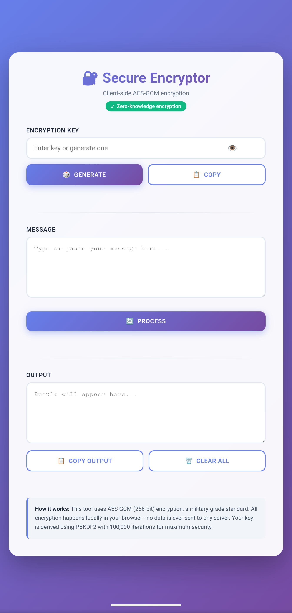

LocalCrypt

Lightweight, local-first encryption tool that runs entirely in the browser using the Web Crypto API. No data leaves your device.

**Try it live:** [Live Demo]()

Preview

---

Overview

LocalCrypt is a minimal client-side encryption utility designed for secure message handling without relying on external servers or third-party services. All cryptographic operations are performed locally in the browser.

The application works fully offline and does not require installation, accounts, or network access.

---

Features

- Generate secure encryption keys
- Encrypt plain text messages
- Decrypt encrypted messages
- Copy key and output with a single click
- Fully offline operation
- No external dependencies
- No data transmission

---

How It Works

LocalCrypt uses the browser's built-in Web Crypto API to perform symmetric encryption directly on the client side.

- Encryption and decryption are executed locally
- No API calls are made
- No data is stored or logged
- No information leaves the device

This ensures privacy and eliminates reliance on cloud services.

---

Usage

1. Open "index.html" in your browser
2. Generate a key or paste your existing key
3. Enter or paste your message
4. Click Encrypt or Decrypt
5. Copy the result if needed

The tool works without internet access.

---

Security Notes

- The security of encrypted data depends on the strength and secrecy of the key
- Always store encryption keys securely
- If a key is lost, encrypted data cannot be recovered
- This tool is intended for educational and lightweight personal use

---

Deployment

To use locally:

- Clone the repository
- Open "index.html" in a modern browser

Optional:
You can enable GitHub Pages to host the tool as a static static site.

---

License

MIT License number
